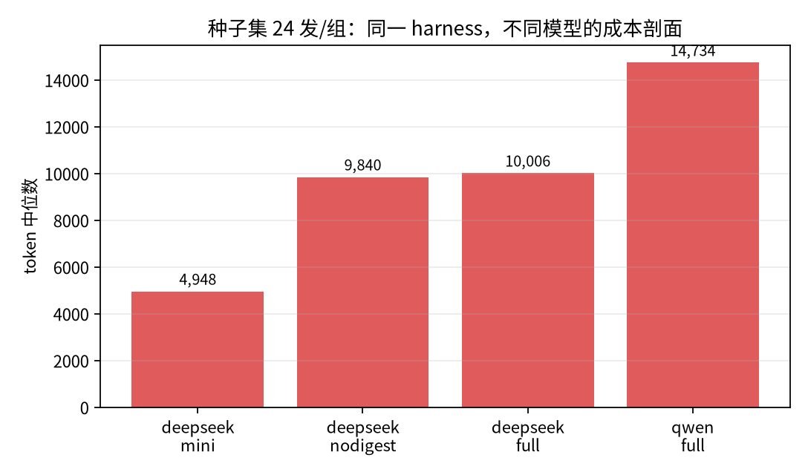
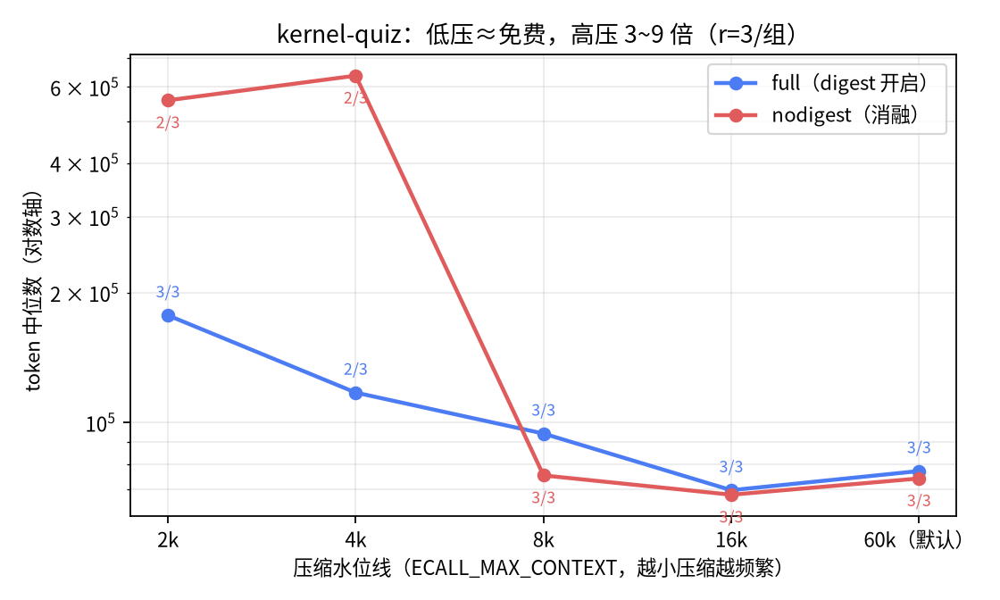
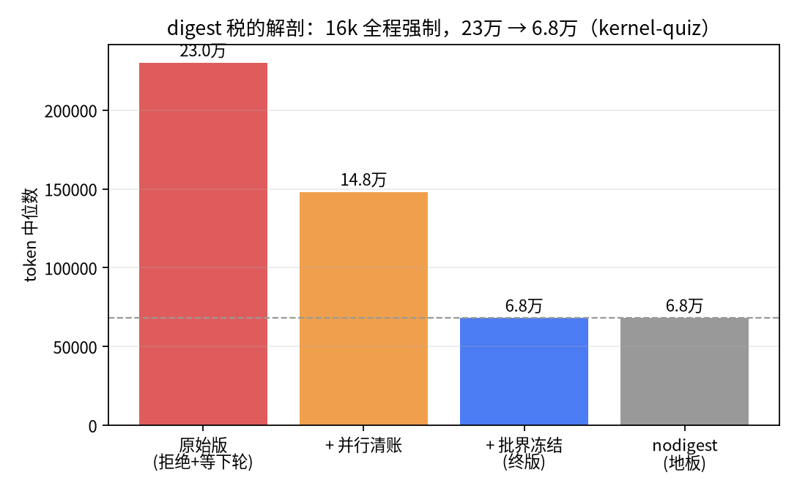
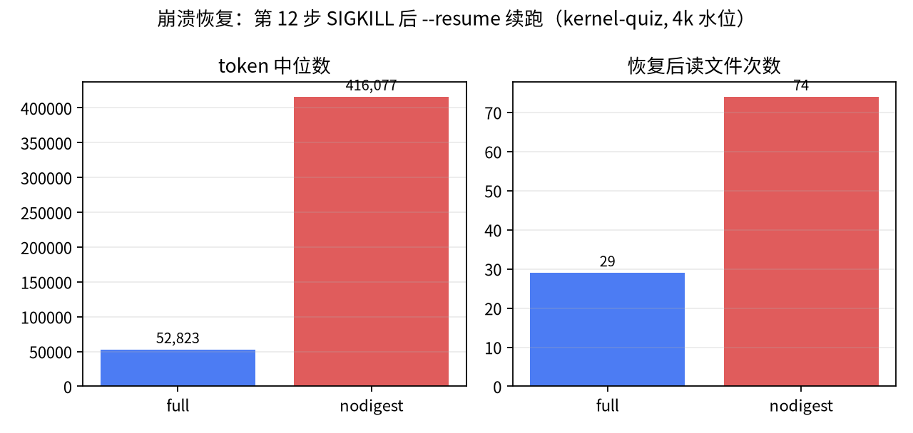

# ecall

[](https://github.com/noppea/ecall/actions/workflows/test.yml)
[](LICENSE)

一个简化的 Claude Code 式编程智能体 harness（~1500 行 Python，零 agent 框架）。

名字来自 RISC-V 的 `ecall` 指令：模型是运行在 ring3 的用户进程，只能发起"系统调用"（tool call）；
runtime 是内核，负责校验、执行、观察，并可以随时中止这次调用。
整个项目的核心命题是：**智能体的能力边界不取决于模型，而取决于内核给它什么样的 ABI。**

- 不依赖任何 agent 框架 / SDK（无 LangChain / AutoGen / Claude SDK 等），仅使用 OpenAI 兼容 API
- 对话历史管理、工具执行、输出解析、循环终止、错误处理全部为手写实现
- 模型无关：换三个环境变量即可切换任意 OpenAI 兼容模型（已在 DeepSeek / Qwen 上验证）

## 两条设计主线

功能表谁都会堆，这个项目真正想验证的是两个设计观点：

**① 轨迹是一等公民（agent flight recorder）。**
所有事件（任务、模型调用、工具执行、检查点、转向指令）落在同一条 JSONL 时间线上。
这条时间线不是调试副产品，而是五个功能的共享底座：

```
                ┌─ replay    回放时间线
                ├─ rewind    逆放 WAL，回滚工作区
  JSONL 轨迹 ───┼─ fork      从任意步分叉出新时间线
                ├─ resume    会话崩溃后重建模型看到的世界
                └─ eval      评测统计的唯一事实来源
```

屏幕输出可以是花哨的、给人看的；但一切机器消费都走轨迹。黑匣子理念：
出事先看飞行记录仪，不猜。

**② 记忆是一个层级体系（和 OS 内存层级同构）。**

| 层级 | 实现 | OS 类比 | 谁写 |
|---|---|---|---|
| 工作记忆 | todo 工具：每步回显在上下文尾部 | 寄存器：最近、最热、容量最小 | 模型写给自己 |
| 主存 | 上下文窗口；超出 60k 触发压缩 | 内存：预算制、页面会老化 | 双方对话产生 |
| 磁盘 | swap 换出：内容寻址落盘，可按需拉回 | swap 分区：换出不丢弃 | runtime 管理 |
| 只读固件 | AGENTS.md：会话开始时冻结注入 | ROM：开机加载、运行期不变 | 人写给模型 |

四种记忆四种写入者、四种生命周期，用一套隐喻统一——这不是事后贴标签，
每个机制的格式与注入时机都是按"它在层级里的位置"设计的。

## 快速开始

```bash
git clone <repo> && cd ecall
python3 -m venv .venv && source .venv/bin/activate
pip install -r requirements.txt

# 配置模型（API key 只走环境变量，仓库里不出现任何密钥）
cp .env.example .env   # 填入你的 key，然后：
set -a && source .env && set +a

# 一次性任务
python3 main.py "写一个命令行 todo 程序并自测"

# 交互式多轮（带会话记忆、token 累计显示、流式输出）
python3 main.py chat

# 崩溃/退出后从轨迹恢复会话，接着聊
python3 main.py chat --resume

# 时间旅行
python3 main.py replay .ecall-log.jsonl        # 回放轨迹
python3 main.py rewind .ecall-log.jsonl -s 12  # 把工作区回滚到第 12 步
python3 main.py fork .ecall-log.jsonl -s 12    # 从第 12 步分叉，换个方向重跑
```

## 功能总览

| 子系统 | 实现 | 文件 |
|---|---|---|
| 主循环 | think → tool_call → observe 循环；4 个终止条件（任务完成 / 步数 / 连续错误 / token 预算）；振荡检测（同一调用重复 3 次拦截） | `agent.py` |
| 工具层 | 11 个工具：read/write/edit_file、list_dir、grep、glob、run_shell、explore、explore_batch、todo、digest；工作区 jail；edit 两级匹配 + 诊断回执 | `tools.py` |
| digest | 模型读完大输出后当场写笔记；压缩换出时笔记取代首行成为占位符，原文留指针可拉回——生成时同步自我压缩 | `tools.py` + `context.py` |
| todo | 模型自维护的任务清单（全量替换语义），每步回显在最新工具结果尾部——对抗上下文漂移的外部记忆 | `tools.py` |
| 沙盒 | bubblewrap：只读根挂载 + 临时 /tmp 与 $HOME + 断网 + 环境变量洗白（API key 不进沙盒）；不可用时自动降级 host 并标注 | `tools.py` |
| 审批门 | 变更型 shell 命令在无沙盒且交互式时需人工确认（y/a）；非交互自动放行不阻塞评测 | `tools.py` |
| 上下文管理 | 60k token 预算；旧工具输出压缩并**内容寻址换出**到 `.ecall-swap/`（git 式去重），模型可按需 read_file 拉回 | `context.py` |
| 子代理 | explore 只读探索员 + explore_batch 并行扇出（≤4）：独立上下文、只读白名单（execute 层强制）、递归套娃双层封堵、token 计入父账单 | `agent.py` |
| 持久化 | 全量事件轨迹（JSONL）+ 文件级 WAL；轨迹是 replay/rewind/fork/评测的唯一事实来源 | `agent.py` |
| 时间旅行 | replay 回放、rewind 逆放 WAL 回滚工作区、fork 从任意历史点分叉续跑、chat --resume 会话恢复 | `timetravel.py` |
| 流式传输 | SSE 默认开启，增量合并 tool_call 分片；`ECALL_NO_STREAM=1` 一键回退 | `llm.py` |
| 项目记忆 | AGENTS.md 声明式项目指令（会话开始时冻结注入，保护前缀缓存） | `agent.py` |
| 中途干预 | 运行中写 `.ecall-steer` 文件，在步边界注入一条用户消息（消费即焚） | `agent.py` |
| 评测 | 8 个种子任务 + 4 个进阶任务 + 7 个内核级大任务（真实 Rust 内核 fixture），临时目录隔离，check 命令退出码作判决，FAIL 自动打印检查器断言，结果落 CSV | `evals/` |
| 测试 | 52 个离线单元测试，零网络零 API，stdlib unittest | `tests/` |

## 评测结果

两个任务集：**种子集**（8 个编程小题：修 bug / 跨文件重命名 / 写 CLI 等）与**进阶集**
（4 个多文件任务：跨 5 文件重构、带测试套件的调试、框架特性扩展、日志考古），
每配置重复 3 次，check 命令退出码判决，报告 pass 率与 token/步数中位数。
除特别标注外，所有数字均由定稿代码（自适应门 + 并行清账 + 批界冻结）
在同一会话内重跑产出，原始数据见 `evals/results.csv` / `evals/crash_results.csv`。

种子集（24 次运行/组）：

| 配置 | DeepSeek | Qwen（qwen3.8-flash） |
|---|---|---|
| full（完整工具面） | 24/24，10006 tok / 4 步 | 24/24，14734 tok / 6 步 |
| mini（仅 bash） | 24/24，4948 tok / 4 步 | — |
| nodigest（digest 消融） | 24/24，9840 tok / 5 步 | — |



进阶集（12 次运行/组，DeepSeek）：full 12/12，14088 tok / 5 步；
mini 12/12，9048 tok / 5 步。

digest 消融（write-as-you-go 任务，进阶集，8k 压缩水位线，**n=40/组**）：

| 配置 | pass | token 中位数 |
|---|---|---|
| full（强制 digest） | 40/40 | 15810 |
| nodigest | 40/40 | 16008 |

内核级任务（真实 Rust 内核 fixture，120 步 / 3M 预算，DeepSeek，r=3/组）。

统计类（census / unwrap / deps / bigfile——答案可由 shell 聚合算出，观察量与仓库规模无关）：

| 任务 | full | nodigest |
|---|---|---|
| census（unsafe/MODS/ARCHS 统计） | 3/3，中位 45,976 tok | 3/3，中位 65,863 tok |
| unwrap（unwrap 计数 + 最密集文件） | 3/3，中位 28,437 tok | 3/3，中位 23,642 tok |
| deps（依赖普查 + 最多依赖 crate） | 3/3，中位 20,184 tok | 3/3，中位 21,300 tok |
| bigfile（文件数/行数/最大文件） | 3/3，中位 19,863 tok | 3/3，中位 17,314 tok |

写作类 kernel-doc（通读全仓库写 ARCH.md，检查器核对真实标识符命中率）：
**full 3/3**（2.20M / 2.73M / 3.08M tok，72~79 步），**nodigest 1/3**——
失败两发里，一发产出被判"疑似泛泛而谈"（ARCH.md 只命中 2 个真实标识符），
一发 120 步预算耗尽。需要全局理解留存的写作任务上，digest 笔记首次分出胜负。

语义饱和任务 kernel-unsafe-audit（为全仓库 228 个 unsafe 块逐个写用途说明，
检查器做全量位置比对 + 说明唯一性防套话；旧代码版本的 case study，n=1/组）：

| 配置 | 结果 | 步数 | token | 备注 |
|---|---|---|---|---|
| full | PASS | 84 | 3.01M | digest 被强制触发 124 次；熔断瞬间恰好写完 |
| nodigest | PASS | 82 | 2.90M | 自然 done；自发派子代理分流（36.6 万 tok，full 组为 0） |

问题后置任务 kernel-quiz（先通读 11 个文件的合成内核、再回答 5 问跨文件事实链）。
默认 60k 水位下两组打平（full 3/3 @77,242 tok，nodigest 3/3 @74,243 tok）——
差异要到压缩高压区才显形，这正是水位线扫描的意义。

水位线扫描（kernel-quiz，DeepSeek，r=3/组，token 中位数；步数/token 预算放宽）：

| 压缩水位线 | full | nodigest | full/nodigest |
|---|---|---|---|
| 16k（几乎无压缩） | 3/3，69,732 | 3/3，68,064 | 1.02× |
| 8k | 3/3，94,346 | 3/3，75,463 | 1.25× |
| 4k | 2/3，**71,357** | 2/3，637,576 | **0.11×** |
| 2k | 3/3，**177,361** | 2/3，559,015 | **0.32×** |

（4k 组 full 的一发 FAIL 为 0 token 秒退、未产生任何 API 调用，两轮扫描中各出现
一次、均在批次首发，疑似 API 侧抖动，未计入成本对比；nodigest 在 4k/2k 各有一发
FAIL，单发 token 高达 2.0M——full 组任何一发都没超过 18.6 万。）



低压区 1.02×（约等于免费）、高压区便宜 3~9 倍且多活一发——终版代码下 digest
已从"需要权衡的保险"变成"没有理由不买"。这个局面是三刀砍出来的
（开发期测量，16k + 全程强制，quiz，token 中位数）：

| enforcement 版本 | 中位 token | 砍的是什么 |
|---|---|---|
| 原始版（拒绝+等下一轮） | 23.0 万 | — |
| + 并行清账 | 14.8 万（6 发） | 强制笔记的专属往返 |
| + 批界冻结（终版） | **6.8 万** | 批内误拒的重发 |



①自适应门（首次压缩事件发生后 enforcement 才上岗，`ECALL_DIGEST_FORCE=1`
恢复全程强制）砍掉无风险时的强制次数；②并行清账（digest 与后续操作同一批
tool_calls 发出，runtime 提前执行 digest、按 call_id 精确配对）砍掉每次强制的
专属全上下文往返；③批界冻结（只有发出本批前已欠的账才够格拒绝）砍掉
并行读 [A, B] 时"A 落地埋雷、同批 B 被炸"的误拒——实弹轨迹抓到每发 5~10 次。

崩溃恢复（crash-resume：quiz 任务跑到第 12 步时 SIGKILL，`chat --resume`
从轨迹重建续跑，4k 水位，r=3/组）：

| 配置 | pass | token（逐发） | 恢复后读文件次数 | digest 次数 |
|---|---|---|---|---|
| full | 3/3 | 22,942 / 52,823 / 212,567 | 17 / 38 / 29 | 3 / 20 / 11 |
| nodigest | 3/3 | 257,463 / 416,077 / 525,156 | 53 / 74 / 83 | 0 |



两组都活了下来，但 full 靠 digest 笔记"回忆"进度，nodigest 只能把文件重读
两三倍"重新调查"——token 中位数差 ≈7.9 倍（52,823 vs 416,077）。
resume 后 digest 笔记能活下来，靠的是重建时从轨迹的 digest 调用事件里
把笔记挂回对应大输出（曾因此踩坑，见 DESIGN.md 事故表）。

digest 三级采用率实验（control policy 消融）：L1 仅提供 schema → 自发采用 0 次；
L2 加入系统提示词原则 → 0 次；L3 runtime 强制 → 饱和任务中单次运行触发 124 次。
终版的并行清账提示下，模型对"digest 与后续操作同批发出"的采纳率为 100%
（实弹轨迹统计，8/8 同批、0 单独）。

五个值得注意的发现：

1. **在两个规模级别上，mini（仅 bash）pass 率均与 full 持平，且稳定省约 36~51% token**——
   bash 是万能观察工具，grep/cat/find 一件不缺，工具面差异被它消解。这复现并加强了
   mini-SWE-agent 的核心论点。因此 full 工具面的价值不在"能做更多事"，而在护栏（jail /
   审批 / undo）、审计（结构化轨迹）与工程化（精确编辑、上下文经济性）——能力趋同，
   可靠性分层。
2. **harness 的影响是模型相关的**：Qwen（qwen3.8-flash）在同一 harness 下种子集
   24/24 满分，但 token 中位比 DeepSeek 同组高 47%（14,734 vs 10,006）、步数多 50%。
   同一 harness 下不同模型成本剖面不同，同一模型在不同 harness 下表现不同——
   脱离 harness 谈模型强弱没有意义。
3. **评测能钓出真实 harness bug**：full 组初测为 22/24，回放失败轨迹定位到 list_dir 把根目录
   打印成工作区同名、诱导模型嵌套写入的 bug；修复后复测回到 24/24。同类事件还有：
   预算护栏对子代理事后结算导致的 fork 炸弹（修复为全局实时熔断）、并行清账的
   批内埋雷误拒（轨迹统计抓到每发 5~10 次残余税，修复为批界冻结）、评测日志
   命名冲突导致跨配置互相覆盖（修复为日志名带模型标签）、fixture 空转时模型
   拒绝编造数据（"证据优先"原则实弹生效）、以及 agent 自主发现"read_file 有 jail
   而 run_shell 没有"的红队行为——这正是 bwrap 沙盒必须默认开启的论据。
4. **自我压缩的价值域在"信息需求后置"的任务。** write-as-you-go 任务（小任务 n=40×2、
   228 条目饱和任务 n=1×2）上 digest 无差异——成果边做边落盘，文件系统是最终的
   记忆外存。信息后置任务上分出胜负：kernel-doc full 3/3 vs nodigest 1/3；
   崩溃恢复 token 中位差 7.9 倍；水位线扫描的高压区（4k/2k）full 便宜 3~9 倍。
   机理：占位符质量决定重读放大系数；首行截断是无选择的信息丢失，digest 是
   有选择的保留。代价侧：原始 enforcement 的固定税曾高达 ≈4 倍（宽松水位下纯属
   浪费），三刀降税后压到 ≈1.02 倍——**保险接近免费后，"始终投保"成为合理默认**。
   诚实声明：quiz 在默认 60k 水位下两组打平（旧代码版曾测出 full 3/3 vs
   nodigest 2/3、5 倍 token 差），该任务的消融差异本身随样本抖动，
   这里把它列为方向性证据，主证据是 kernel-doc、crash-resume 与高压水位三组。
5. **检查器也是软件，也有边界用例 bug。** kernel-deps 初版检查器没考虑"零依赖 + 全员并列"
   的退化情形：模型正确回答 DEPS=0 与 MAXCRATE=N/A，却被要求等于 max() 任意挑出的路径，
   10/10 团灭——暴露的是 eval bug 而非模型缺陷。修复经历三轮（接受 N/A → 接受空值 →
   prompt 显式约定退化协议），教训：**精确匹配类评测里，"答案不存在"情形的输出协议必须显式约定**。

生成可视化报告：`python3 evals/report.py`（results.csv → 单文件 HTML，零依赖）；
画汇报图：`python3 evals/figs.py`（matplotlib → evals/figs/ 四张 PNG：水位线扫描、降税解剖、崩溃恢复、跨模型对比）。

复现：`python3 evals/run_eval.py -c full -m deepseek -r 3`（`-c mini` 切换消融组，`-m` 只是分组标签）。

## 设计文档

见 [DESIGN.md](DESIGN.md)：威胁模型、每个机制的"为什么"、事故—修复对照表、评测方法论。

## 目录结构

```
main.py        入口：一次性任务 / chat 多轮 / replay / rewind / fork
agent.py       主循环、终止条件、振荡检测、子代理、AGENTS.md、steer
tools.py       工具实现与 Schema、工作区 jail、bubblewrap 沙盒、审批门
llm.py         API 客户端、流式聚合、错误分类（致命/溢出/瞬时）、重试
context.py     token 估算、压缩、swap 换出（内容寻址）
timetravel.py  轨迹加载、回放、WAL 回滚、分叉
evals/         任务集、评测脚本、results.csv
```
